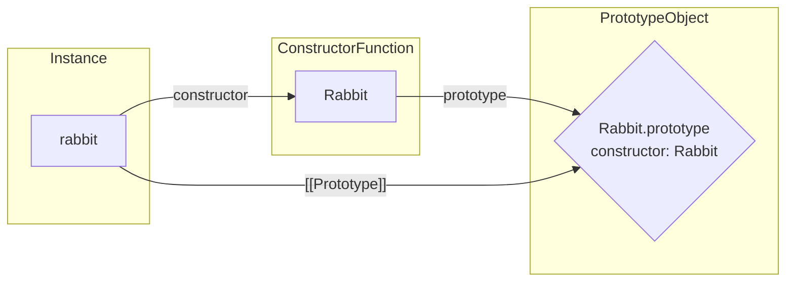

# F.prototype
Khi bạn tạo object bằng constructor function thông qua new F(), JavaScript sẽ:

➡️ Lấy F.prototype và gán nó làm [[Prototype]] cho object mới.

Đây là cách JS xây dựng cơ chế kế thừa (prototypal inheritance) trước khi ES6 class xuất hiện.

# 1. Cách F.prototype hoạt động
```js
let animal = {
  eats: true
};

function Rabbit(name) {
  this.name = name;
}

Rabbit.prototype = animal;

let rabbit = new Rabbit("White Rabbit"); //  rabbit.__proto__ == animal

alert( rabbit.eats ); // true
```

Giải thích:

- Khi new Rabbit("White Rabbit") chạy
- JS không sao chép các thuộc tính từ animal
- JS chỉ gán [[Prototype]] của rabbit = animal
- → nên rabbit có thể truy cập animal.eats nhờ kế thừa

## 2. F.prototype chỉ được dùng khi tạo object mới
```js
function Rabbit() {}
Rabbit.prototype = animal;

let rabbit1 = new Rabbit();

Rabbit.prototype = {}; // đổi prototype khác

let rabbit2 = new Rabbit();
```

Kết quả:
```
rabbit1.__proto__ = animal

rabbit2.__proto__ = {}
```
➡️ Object đã tạo giữ nguyên prototype cũ.

## 3. Giá trị mặc định của F.prototype

Mọi function đều có prototype mặc định:

```js
function Rabbit() {}
// by default:
// Rabbit.prototype = { constructor: Rabbit }

let rabbit = new Rabbit(); // inherits from {constructor: Rabbit}

alert(rabbit.constructor == Rabbit); // true (from prototype)
```


Kiểm tra:
```js
function Rabbit() {}
alert( Rabbit.prototype.constructor == Rabbit ); // true
```

➡️ Mặc định, mọi object được tạo bằng new Rabbit() đều có constructor = Rabbit.

Ta có thể dùng constructor của một object để tạo object mới:
```js
function Rabbit(name) {
  this.name = name;
  alert(name);
}

let rabbit = new Rabbit("White Rabbit");

let rabbit2 = new rabbit.constructor("Black Rabbit");
```
## 4. Cảnh báo quan trọng: ghi đè prototype làm mất constructor

Nếu bạn thay thế prototype bằng object mới, bạn mất constructor mặc định:
```js
function Rabbit() {}
Rabbit.prototype = {
  jumps: true
};

let rabbit = new Rabbit();
alert(rabbit.constructor === Rabbit); // false
```

Vì object mới không chứa thuộc tính constructor.

## 5. Cách giữ lại constructor đúng
### Cách 1 — Chỉ thêm thuộc tính, không ghi đè
```js
function Rabbit() {}

// Not overwrite Rabbit.prototype totally
Rabbit.prototype.jumps = true;
// constructor vẫn còn
```
### Cách 2 — Ghi đè nhưng bổ sung constructor thủ công
```js
Rabbit.prototype = {
  jumps: true,
  constructor: Rabbit
};
```
## 6. prototype trên object bình thường KHÔNG có ý nghĩa đặc biệt
```js
let user = {
  name: "John",
  prototype: "Bla-bla" // no magic at all
};
```

Chỉ functions dùng với new mới kích hoạt cơ chế F.prototype → [[Prototype]].

## 🎯 Summary – Tóm tắt cực ngắn

- F.prototype (một thuộc tính bình thường) → được dùng khi gọi new F()
→ thiết lập [[Prototype]] cho object mới.
- Không ảnh hưởng đến object đã tạo.
- Mặc định `F.prototype = { constructor: F }`.
- Ghi đè prototype làm mất constructor, cần tự thêm lại.
- Trên object thường, thuộc tính `"prototype"` không có tác dụng đặc biệt.

# BÀI TẬP

## Bài tập 1 : Changing "prototype"

Trong đoạn code dưới đây, chúng ta tạo một Rabbit mới và sau đó thử thay đổi prototype của nó.

Ban đầu ta có đoạn code sau:
```js
function Rabbit() {}
Rabbit.prototype = {
  eats: true
};

let rabbit = new Rabbit();

alert( rabbit.eats ); // true
```

Chúng ta thêm một dòng nữa (đã nhấn mạnh). Lúc này alert sẽ hiển thị gì?
```js
function Rabbit() {}
Rabbit.prototype = {
  eats: true
};

let rabbit = new Rabbit();

Rabbit.prototype = {}; 
alert( rabbit.eats ); // ? 
```

…Và nếu code thay bằng đoạn sau (thay thế 1 dòng)?
```js
function Rabbit() {}
Rabbit.prototype = {
  eats: true
};

let rabbit = new Rabbit();

Rabbit.prototype.eats = false;

alert( rabbit.eats ); // ?
```

Và trường hợp này (thay thế 1 dòng)?
```js
function Rabbit() {}
Rabbit.prototype = {
  eats: true
};

let rabbit = new Rabbit();

delete rabbit.eats;

alert( rabbit.eats ); // ?
```

Trường hợp cuối:
```js
function Rabbit() {}
Rabbit.prototype = {
  eats: true
};

let rabbit = new Rabbit();

delete Rabbit.prototype.eats;

alert( rabbit.eats ); // ?
```

### Solution
Kết quả hiển thị lần lượt là:
1. true, vì thuộc tính được tìm thấy trong Rabbit.prototype
2. false, vì thuộc tính được tìm thấy trong Rabbit.prototype
3. true, vì thuộc tính được tìm thấy trong Rabbit.prototype
4. undefined, vì thuộc tính đã bị xóa khỏi Rabbit.prototype

## Bài tập 2 : Create an object with the same constructor

importance: 5

Giả sử ta có một object tùy ý obj, được tạo bởi một constructor function – nhưng ta không biết constructor nào.

Ta muốn tạo một object mới bằng chính constructor đó.

Liệu ta có thể làm như sau không?
```js
let obj2 = new obj.constructor();
```

Hãy đưa ra:

Một ví dụ constructor khiến đoạn code trên hoạt động đúng, và

Một ví dụ khiến nó hoạt động sai.

### Solution
Ví dụ hoạt động đúng:
```js
function Obj() {
  
}
let obj = new Obj();
let obj2 = new obj.constructor(); // works
```
Ví dụ hoạt động sai:
```js
function Obj() {
  
}
Obj.prototype = {}; // overwrite prototype, mất constructor
let obj = new Obj();
let obj2 = new obj.constructor(); // Error
```