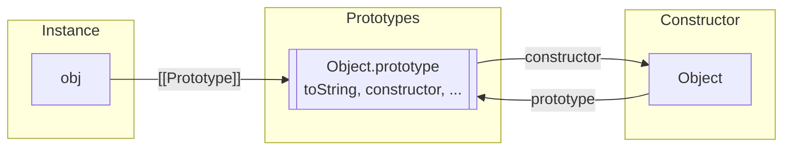
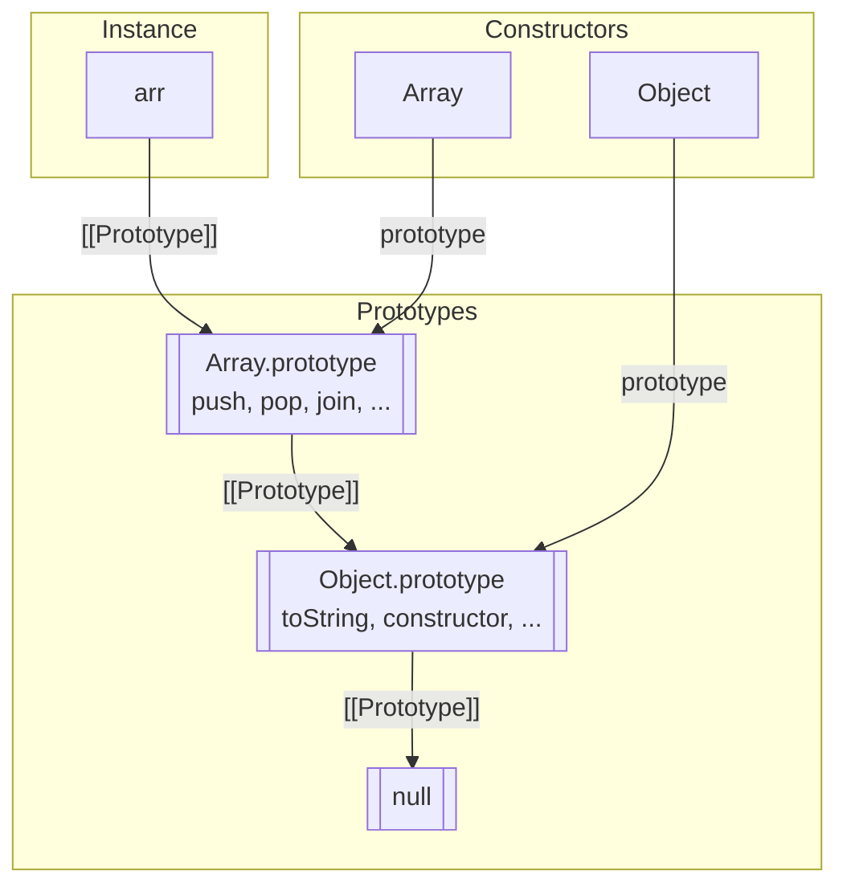
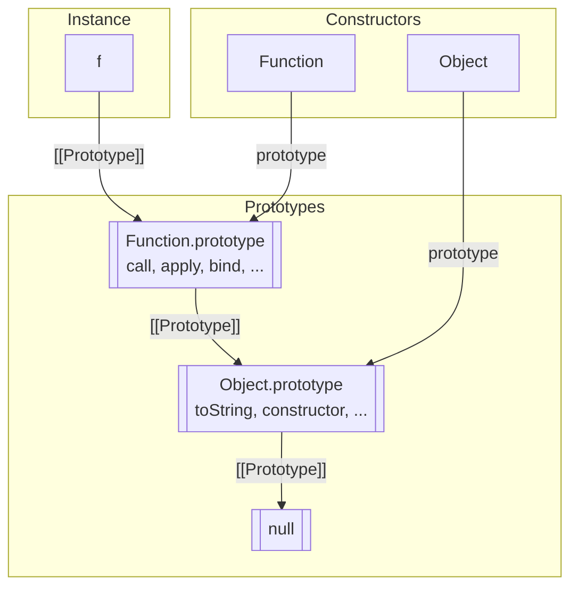
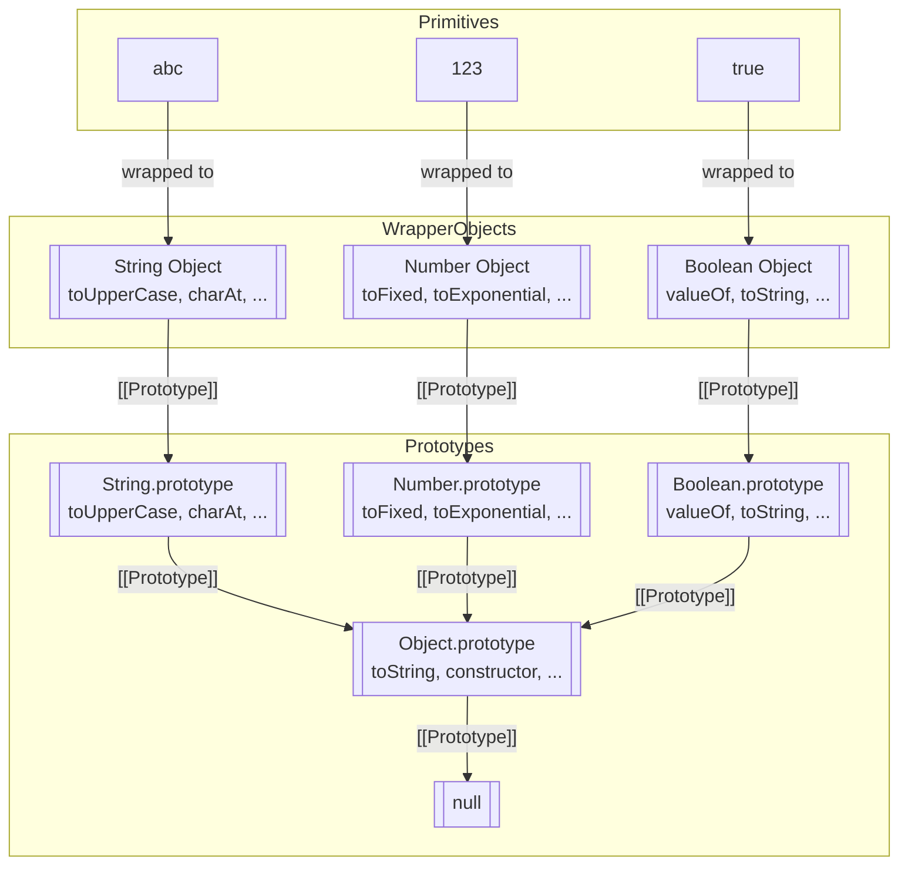

# Native Prototypes
Native prototypes là gì ? 
Native prototypes là các prototype mặc định được cung cấp bởi JavaScript cho các kiểu dữ liệu built-in như Object, Array, Function, String, Number, Boolean, v.v. Chúng chứa các phương thức và thuộc tính mà tất cả các instance của các kiểu dữ liệu này có thể sử dụng thông qua cơ chế kế thừa prototype.

## 1. Object.prototype – mọi object đều kế thừa từ đây

Khi bạn tạo object:
```js   
let obj = {};
alert( obj ); // "[object Object]"
```

Dù obj rỗng, nó vẫn có method toString()—vì:
- `{}` thực chất là `new Object()`
- Và object mới sẽ có [[Prototype]] = Object.prototype

Kiểm tra:
```js
let obj = {};

alert(obj.__proto__ === Object.prototype); // true

alert(obj.toString === obj.__proto__.toString); // true
alert(obj.toString === Object.prototype.toString); // true
```
Sơ đồ minh họa:


Đỉnh của prototype chain:
```js
alert(Object.prototype.__proto__); // null
```
## 2. Các prototype built-in khác: Array, Date, Function…

Mọi kiểu built-in đều hoạt động giống nhau:

- Array → kế thừa từ Array.prototype
- Function → kế thừa từ Function.prototype

Và tất cả đều cuối cùng kế thừa từ Object.prototype

Ví dụ:
```js
let arr = [1, 2, 3];

alert( arr.__proto__ === Array.prototype ); // true
alert( arr.__proto__.__proto__ === Object.prototype ); // true
alert( arr.__proto__.__proto__.__proto__ ); // null
```
instance.`__proto__` -> [[Prototype]] trỏ tới prototype của nó.
Sơ đồ minh họa:


Một số prototype override phương thức:
```js
let arr = [1, 2, 3]
alert(arr); // 1,2,3  <-- Array.prototype.toString
```
## 3. Function cũng là object
```js
function f() {}

alert(f.__proto__ == Function.prototype); // true
alert(f.__proto__.__proto__ == Object.prototype); // true
```
Sơ đồ minh họa:

## 4. Primitives (string, number, boolean)

Dù không phải object, nhưng khi truy cập thuộc tính, chúng được bọc tạm bằng wrapper object:

- `"abc"` → new String("abc")
- `123` → new Number(123)

→ nên `"abc".toUpperCase()` vẫn hoạt động.

Các method lưu trong:
- String.prototype
- Number.prototype
- Boolean.prototype
⚠️ `null` và `undefined` không có wrapper object → không có prototype.

**Lưu ý :** 
- "abc", 123, true là primitive (kiểu nguyên thủy), không phải object, nên bản thân nó không có [[Prototype]].
- Chỉ object mới có [[Prototype]] chain: someObj -> someProto -> Object.prototype -> null.

Sơ đồ minh họa:

## 5. Thay đổi native prototype (cực kỳ nguy hiểm)
Bạn có thể thêm method vào native prototype:
```js
String.prototype.show = function() {
  alert(this);
};

"BOOM!".show(); // BOOM!
```

⚠️ Nhưng đây là anti-pattern vì:

- Prototype là global
- Hai thư viện có thể ghi đè nhau → gây lỗi khó tìm

Chỉ nên làm khi polyfill:
```js
if (!String.prototype.repeat) {
  String.prototype.repeat = function(n) {
    return new Array(n + 1).join(this);
  };
}

alert( "La".repeat(3) ); // LaLaLa
```
## 6. Borrowing (mượn phương thức)

Bạn có thể "mượn" method từ prototype khác:
```js
let obj = {
  0: "Hello",
  1: "world!",
  length: 2,
};

obj.join = Array.prototype.join;

alert( obj.join(',') ); // Hello,world!
```

→ Hoạt động vì join() chỉ quan tâm đến length & numeric keys.

Hoặc kế thừa từ Array trực tiếp:
```js
obj.__proto__ = Array.prototype;
```

⚠️ Nhưng bạn chỉ có thể kế thừa từ một object.

## 🎯 Summary – Tóm lược súc tích nhất

1. Mọi built-in đều lưu method trong prototype:
   - Array.prototype, Object.prototype, Function.prototype, String.prototype…
2. Object chỉ chứa dữ liệu, còn method nằm trong prototype.
3. Primitives dùng các wrapper prototype (String, Number, Boolean).
`null` và `undefined` thì không có prototype.
4. Bạn có thể sửa native prototypes, nhưng cực kỳ nguy hiểm:
   - Chỉ nên dùng cho polyfill.
5. Method borrowing giúp object thường có thể dùng method của Array/Function mà không cần kế thừa.