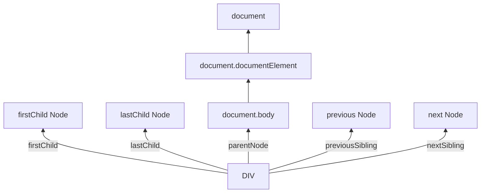

# Walking the DOM



## 1. Mọi thứ bắt đầu từ document

Muốn đụng vào DOM thì entry point luôn là document.
Từ document ta đi tới các node khác.

Các node “gốc” hay dùng:
- document.documentElement → thẻ `<html>`
- document.body → thẻ `<body>`
- document.head → thẻ `<head>`

**Lưu ý**: nếu script chạy trong `<head>` thì lúc đó `<body>` chưa được parser xong → `document.body === null`.

```html
<html>

<head>
  <script>
    alert( "From HEAD: " + document.body ); // null, there's no <body> yet
  </script>
</head>

<body>

  <script>
    alert( "From BODY: " + document.body ); // HTMLBodyElement, now it exists
  </script>

</body>
</html>
```
Trong DOM, null nghĩa là “không tồn tại / không có node đó”.

## 2. Children & Descendants – đi xuống dưới
**Khái niệm:**

- **Child nodes (children)**: con trực tiếp.
- **Descendants**: tất cả con – cháu – chắt bên trong (cả cây).

```html
<html>
<body>
  <div>Begin</div>

  <ul>
    <li>
      <b>Information</b>
    </li>
  </ul>
</body>
</html>
```
- `body` có children: `<div>`, text node, `<ul>`, …
- `<li>` và `<b>` là descendants của `<body>` (nhưng không phải direct child).
`childNodes`, `firstChild`, `lastChild`

`elem.childNodes `trả về tất cả node con (bao gồm text, comment…).

Ví dụ:

```html
<html>
<body>
  <div>Begin</div>

  <ul>
    <li>Information</li>
  </ul>

  <div>End</div>

  <script>
    for (let i = 0; i < document.body.childNodes.length; i++) {
      alert( document.body.childNodes[i] ); // Text, DIV, Text, UL, ..., SCRIPT
    }
  </script>
  ...more stuff...
</body>
</html>
```


Shorthand:

```elem.childNodes[0] === elem.firstChild
elem.childNodes[elem.childNodes.length - 1] === elem.lastChild
```
Kiểm tra có con không:

```elem.hasChildNodes()```

## 3. DOM collection – giống array nhưng không phải array

`childNodes` là collection dạng array-like, iterable:

- Dùng được for..of
- Không dùng được các method Array như .filter(), .map() trực tiếp.

```js
for (let node of document.body.childNodes) {
  alert(node); // shows all nodes from the collection
}

alert(document.body.childNodes.filter); // undefined (there's no filter method!)
alert( Array.from(document.body.childNodes).filter ); // function
```

Đặc điểm quan trọng:

- Read-only: không gán childNodes[i] = ....
- Live: DOM thay đổi thì collection tự cập nhật theo.
- Không dùng for..in để lặp, vì nó lôi thêm cả thuộc tính khác:

```html
<body>
<script>
  // shows 0, 1, length, item, values and more.
  for (let prop in document.body.childNodes) alert(prop);
</script>
</body>
```

## 4. Đi lên và đi ngang: parent & siblings

- parentNode → cha
- nextSibling → anh em kế bên phải
- previousSibling → anh em kế bên trái

```js
    // parent of <body> is <html>
    console.log(document.body.parentNode === document.documentElement); // true

    // after <head> goes <body>
    console.log(document.head.nextSibling); // Text node (whitespace)
    console.log(document.head.nextElementSibling); // HTMLBodyElement
    console.log(document.head.nextElementSibling === document.body); // true

    // before <body> goes <head>
    console.log(document.body.previousSibling); // Text node (whitespace)
    console.log(document.body.previousElementSibling); // HTMLHeadElement
    console.log(document.body.previousElementSibling === document.head); // true
```

## 5. Element-only navigation – bỏ qua text/comment

Rất nhiều lúc ta chỉ muốn element node (thẻ), bỏ qua text node, comment…

Có bộ property chuyên cho element:

- `elem.children` – chỉ các con là element
- `firstElementChild`, `lastElementChild`
- `previousElementSibling`, `nextElementSibling`
- `parentElement`

`parentNode` vs `parentElement`
```js
console.log( document.documentElement.parentNode );    // document
console.log( document.documentElement.parentNode );    // do( document.documentElement.parentElement ); // null
```


`<html>` có parent là `document` ( là document node không phải element) nên `parentElement` trả `null`.

Ví dụ leo lên tới `<html>` nhưng không lên `document`:

```js
while(elem = elem.parentElement) { // go up till <html>
  console.log( elem); 
}
```

Ví dụ dùng `children` (element only)
```html
<html>
<body>
  <div>Begin</div>

  <ul>
    <li>Information</li>
  </ul>

  <div>End</div>

  <script>
    for (let elem of document.body.children) {
      console.log(elem); // DIV, UL, DIV, SCRIPT
    }
  </script>
  ...
</body>
</html>
```
Ở đây, không còn text node, chỉ hiện element.

## 6. Trường hợp đặc biệt: Bảng (`<table>`)

Element dạng table có thêm API riêng để truy cập nhanh: ý muốn nói ngoài các thuộc tính chung như children, childNodes, firstChild,... table còn có thêm các thuộc tính/phương thức đặc biệt riêng như rows,cells, tBodies, tHead,...

```html
<table id="table">
  <tr>
    <td>one</td><td>two</td>
  </tr>
  <tr>
    <td>three</td><td>four</td>
  </tr>
</table>

<script>
  // get td with "two" (first row, second column)
  let td = table.rows[0].cells[1];
  td.style.backgroundColor = "red"; // highlight it
</script>
```

Một số property hay dùng:

- table.rows – tất cả <tr>
- table.tBodies, table.tHead, table.tFoot, table.caption
- tbody.rows
- tr.cells, tr.rowIndex, tr.sectionRowIndex
- td.cellIndex

## 7. Tóm tắt nhanh

- Bắt đầu từ document → documentElement, body, head.
- Dùng:
  - Tất cả node: parentNode, childNodes, firstChild, lastChild, previousSibling, nextSibling.
  - Element-only: parentElement, children, firstElementChild, lastElementChild, previousElementSibling, nextElementSibling.

- DOM collections:
  - Iterable (for..of), array-like.
  - Read-only, live.
- Có thêm navigation đặc biệt cho một số element như table.

